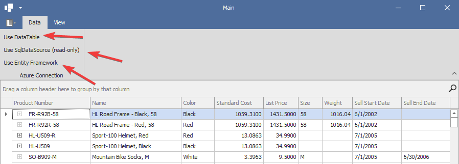

# How to load data from the Azure SQL data base and show it in GridControl

This example illustrates how to fetch data from the [Azure SQL data base](https://azure.microsoft.com/en-us/services/sql-database/) and show it in [GridControl](https://docs.devexpress.com/WindowsForms/DevExpress.XtraGrid.GridControl).

**GridControl**, as any data-aware control, requires **IList** or **IListSource** as a data source. That is why, all you need is to ensure that your data set fetched from **Azure** implements either of these interfaces. Refer to the [Data Binding](https://docs.devexpress.com/WindowsForms/634/controls-and-libraries/data-grid/data-binding) help article to learn more.

Generally, standard approaches you used to use with a regular SQL data base are still applicable here. Nothing special is necessary to connect to your Azure SQL data base. In particular, this example illustrates how to use **SqlDataAdapter**, our read-only [SqlDataSource](https://docs.devexpress.com/CoreLibraries/DevExpress.DataAccess.Sql.SqlDataSource), and **Entity Framework** to fetch data from **Azure**.

Here, we fetch data from a database containing the **AdventureWorksLT** sample data. You can generate a data base with the same data as described in the [Quickstart: Create a single database in Azure SQL Database using the Azure portal, PowerShell, and Azure CLI](https://docs.microsoft.com/en-us/azure/sql-database/sql-database-single-database-get-started?tabs=azure-portal) Microsoft topic. Do not forget to create a server-level firewall rule for your data base as described in the [Quickstart: Create a server-level firewall rule for single and pooled databases using the Azure portal](https://docs.microsoft.com/en-us/azure/sql-database/sql-database-server-level-firewall-rule) Microsoft article.

To run this example, it is also necessary to specify your connection settings in the **Main** method:

